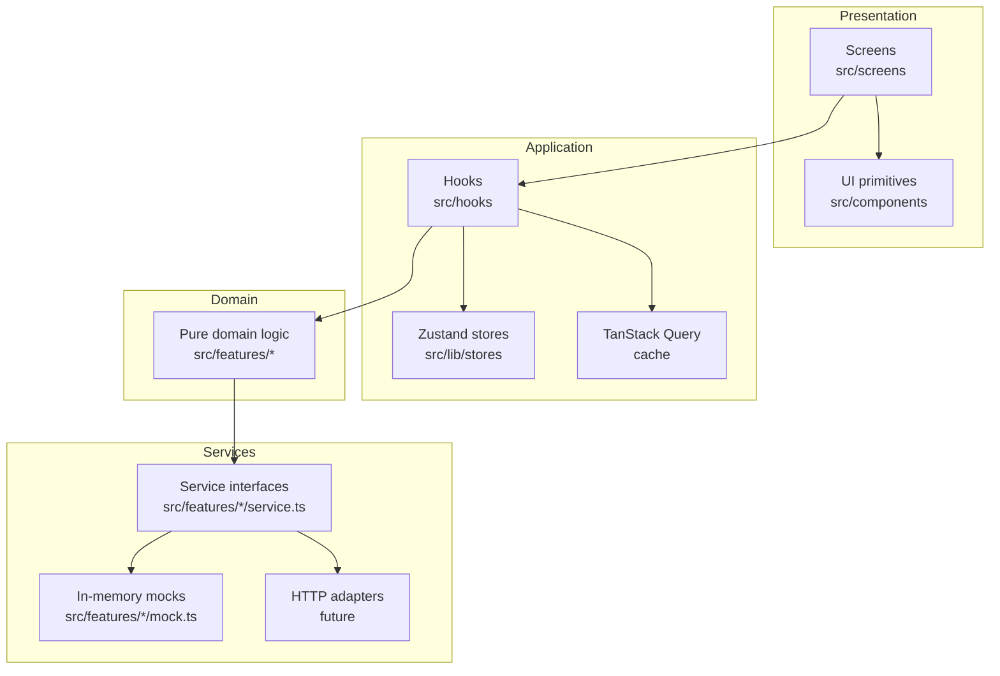
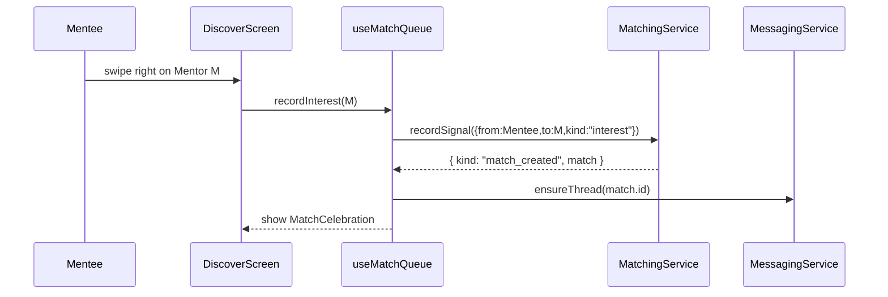
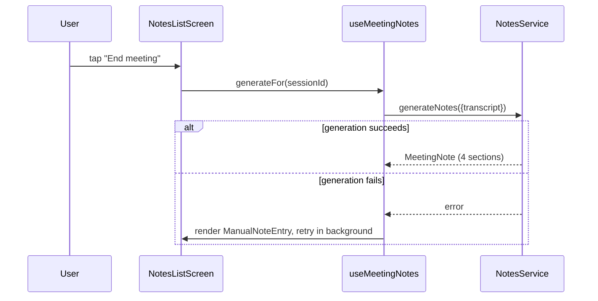

# MentorMatch MVP — Design

## Overview

MentorMatch MVP is a mobile-first web application that matches mentees with mentors using a Tinder-style swipe flow, then unlocks messaging and AI-generated meeting notes once both sides express interest. The product is delivered as a single-page React 18 + TypeScript app (Vite-built, Tailwind-styled) so we can iterate on the prototype flows from the Miro board "Finder" without paying the native toolchain tax. Once flows stabilize we can wrap with Capacitor or port to React Native.

The MVP is shipped **mock-first**. Every backend dependency — auth provider, matching algorithm, messaging transport, AI notes generator, calendar sync — sits behind a small TypeScript interface in `src/features/<domain>/` with an in-memory mock implementation. Wiring the real backend (Node + Fastify, Postgres, Redis, S3, OpenAI) means swapping the adapter, not rewriting screens.

The design covers seven feature pillars from the requirements:

1. Authentication and role selection (Req. 1)
2. Mentee profile onboarding (Req. 2)
3. Mentor profile onboarding with verification (Req. 3)
4. AI matching and the Discover swipe queue (Req. 4)
5. Matches and messaging (Req. 5)
6. AI meeting notes (Req. 6)
7. Profile, availability, and plan management (Req. 7)

…plus the cross-cutting concerns from Req. 8 (accessibility, performance, security, observability).

### Key design decisions

- **Mocks behind interfaces, screens stay dumb.** Logic lives in hooks and pure functions in `src/features/`. Screens render and dispatch; they do not own business rules. This keeps the eventual backend swap cheap and makes the interesting code property-testable.
- **Zustand for app state, TanStack Query for server cache.** Auth session, current role, and plan tier are app-global concerns (Zustand). Candidate queue, match list, threads, and notes are server-cached collections (TanStack Query). The split avoids re-implementing cache invalidation in stores.
- **Time stored in UTC, displayed in IANA local zones.** Availability windows are authored in the user's local zone and stored as UTC ranges plus the originating IANA zone. We never compare wall-clock times across users.
- **Free-tier cap is enforced when a match would be created, not when a user swipes.** A capped mentee can still express interest; the match record is only created when the cap allows it. This matches the requirement (Req. 4.7) and avoids penalizing the swipe UX.

## Architecture

### Layered architecture



- **Presentation layer** holds screens (`src/screens/Auth`, `Onboarding`, `Discover`, `Matches`, `Chat`, `MeetingNotes`, `Profile`) and shared primitives (`Button`, `Card`, `Sheet`, `SwipeCard`, `Tag`, `Avatar`, `FormField`, `Stepper`, `EmptyState`). Screens are dumb — they read from hooks and forward events.
- **Application layer** holds hooks (`useAuth`, `useMatchQueue`, `useMessageThread`, `useMeetingNotes`, `useProfile`, `usePlan`) plus app-state stores and the TanStack Query client.
- **Domain layer** holds pure, framework-agnostic functions: match scoring, queue ordering, validation schemas, time conversions. These are the property-tested core.
- **Services layer** is a thin set of TypeScript interfaces with a mock implementation today and an HTTP implementation later. Selection happens via a `ServiceProvider` React context wired in `App.tsx`.

### Routing

React Router v6, kebab-case paths, mobile-first layouts.

```mermaid
graph LR
  Root[/] -->|unauth| Auth[/auth]
  Root -->|auth, no role| RoleSelect[/auth/role]
  Root -->|auth, no profile| Onboarding[/onboarding]
  Root -->|auth, profile| Discover[/discover]
  Discover --> Matches[/matches]
  Matches --> Chat[/chat/:matchId]
  Chat --> Notes[/meeting-notes/:matchId]
  Notes --> NoteDetail[/meeting-notes/:matchId/:noteId]
  Discover --> Profile[/profile]
  Profile --> Availability[/profile/availability]
  Profile --> Plan[/profile/plan]
```

Routing rules implement Req. 1.4 and Req. 1.5:

- `<AuthGate>` wraps protected routes. Unauthenticated users are redirected to `/auth`.
- `<RoleGate>` redirects authenticated users without a role to `/auth/role`.
- `<ProfileGate>` redirects users without a complete profile to `/onboarding`.
- The auth/marketing routes are explicitly allowed for unauthenticated users.

### State strategy

| Concern                              | Holder                       | Why                                          |
|--------------------------------------|------------------------------|----------------------------------------------|
| Auth session, role, plan tier        | Zustand `useSessionStore`    | Read everywhere, rarely written              |
| Onboarding wizard draft              | Zustand `useOnboardingStore` | Persists across reloads (Req. 2.4)           |
| Candidate queue                      | TanStack Query               | Server-cached, paged, refetched on profile edit |
| Match list                           | TanStack Query               | Server-cached, mutated on match creation     |
| Message thread                       | TanStack Query + subscription| Server cache plus live update channel        |
| Meeting notes                        | TanStack Query               | Server-cached, regenerated on demand         |
| Calendar busy blocks                 | TanStack Query (15-min stale)| Polled per Req. 7.4                          |

Zustand stores persist to `localStorage` via `zustand/middleware` for the onboarding draft. The session store keeps tokens in memory only and clears them on sign-out (Req. 8.5).

### Service composition

```ts
// src/features/serviceProvider.tsx
type Services = {
  auth: AuthService;
  matching: MatchingService;
  messaging: MessagingService;
  notes: NotesService;
  profile: ProfileService;
  calendar: CalendarService;
  plan: PlanService;
};

const ServiceContext = createContext<Services | null>(null);
export function useServices() { /* ... */ }
```

`App.tsx` instantiates the mock services for MVP. A future change is "swap the factory in `App.tsx`," not a screen rewrite.

## Components and Interfaces

### Cross-screen UI primitives (`src/components/`)

| Component         | Responsibility                                                              |
|-------------------|-----------------------------------------------------------------------------|
| `Button`          | Primary, secondary, ghost variants. Brand violet `#7C3AED` for primary.     |
| `Card`            | Rounded surface used by SwipeCard and list items.                           |
| `Sheet`           | Bottom sheet for mobile-first dialogs.                                      |
| `Avatar`          | Circular avatar with fallback initials.                                     |
| `Badge`           | Match-percentage badge and "Verified Mentor" badge.                         |
| `Tag`             | Skill/interest chip used in profiles and swipe cards.                       |
| `FormField`       | Label + input + error wrapper, integrates with `react-hook-form`.           |
| `Stepper`         | Onboarding step indicator.                                                  |
| `EmptyState`      | Reusable empty/queue-exhausted state.                                       |
| `SwipeCard`       | Presentational swipeable card. Gesture handling lives in `SwipeDeck`.       |
| `MatchBadge`      | Renders match percentage with color ramp by score.                          |

### Screen modules

#### `screens/Auth/`

- `AuthScreen` — Google + email forms, switches to sign-up via tab.
- `RoleSelectScreen` — two cards ("Mentee" / "Mentor"), persists role on tap.
- `LoginForm`, `SignUpForm` use `react-hook-form` + `zod`.

Validates Req. 1.1, 1.2, 1.3.

#### `screens/Onboarding/`

- `OnboardingWizard` — orchestrates role-specific steps, persists draft.
- `MenteeSteps/` — `SubjectsStep`, `CareerInterestsStep`, `BackgroundStep`, `OtherInterestsStep`, `LanguagesStep`, `MeetingFrequencyStep`, `TeachingStyleStep`, `ValuesStep`.
- `MentorSteps/` — `TeachingStyleStep`, `AreasToTeachStep`, `ExperienceStep`, `IndustriesStep`, `AvailabilityStep`, `LanguagesStep`, `ValuesStep`, `SupportedBackgroundsStep`, `VerificationStep`.
- `VerificationUpload` — file picker, sets `verification_status = "pending"`.

Validates Req. 2.1–2.4, Req. 3.1–3.5.

#### `screens/Discover/`

- `DiscoverScreen` — fetches queue via `useMatchQueue`, hosts `SwipeDeck`.
- `SwipeDeck` — gesture handler, exposes `onSwipeLeft`/`onSwipeRight` and the green-check / red-X tap targets.
- `MatchCelebration` — full-screen modal when a mutual right-swipe creates a match.
- `EmptyQueue` — renders when the queue is exhausted (Req. 4.6).

Validates Req. 4.1–4.7.

#### `screens/Matches/`

- `MatchesScreen` — list of unarchived matches with last-message preview and match percentage.
- `MatchListItem` — partner avatar, name, badge, preview, unread dot.

Validates Req. 5.1.

#### `screens/Chat/`

- `ChatScreen` — header + `MessageList` + `Composer`.
- `MessageList` — virtualized message bubbles.
- `ConversationPrompts` — surfaces 3 AI-suggested openers when the thread is empty.
- `Composer` — text input + send button.
- `SchedulingCard` — inline card rendered when a message proposes a meeting.
- `ReengagementBanner` — surfaced when `now - thread.lastMessageAt >= 14 days`.

Validates Req. 5.2–5.5.

#### `screens/MeetingNotes/`

- `NotesListScreen` — chronological session list per match (Req. 6.3).
- `NoteDetailScreen` — renders all four sections (Req. 6.4).
- `ManualNoteEntry` — fallback editor when generation fails (Req. 6.5).

Validates Req. 6.1–6.5.

#### `screens/Profile/`

- `ProfileScreen` — read view of profile fields and current plan.
- `ProfileEditScreen` — edit form, persists changes and queues re-score.
- `AvailabilityScreen` — list of windows + "Sync with Google Calendar" toggle.
- `PlanScreen` — shows current tier and upgrade options.

Validates Req. 7.1–7.5.

### Hooks

```ts
// useAuth — wraps AuthService + session store.
function useAuth(): {
  session: Session | null;
  signInWithGoogle(): Promise<void>;
  signUpWithEmail(input: SignUpInput): Promise<void>;
  signOut(): Promise<void>;
  setRole(role: Role): Promise<void>;
};

// useMatchQueue — paginated queue with optimistic swipe handling.
function useMatchQueue(): {
  queue: CandidateProfile[];
  isLoading: boolean;
  recordInterest(candidateId: UserId): Promise<MatchOutcome>;
  recordPass(candidateId: UserId): Promise<void>;
};

// useMessageThread — live message list with optimistic send.
function useMessageThread(matchId: MatchId): {
  thread: MessageThread | undefined;
  send(body: string): Promise<void>;
  proposeMeeting(slot: TimeSlot): Promise<void>;
};

// useMeetingNotes — session list + generator entry point.
function useMeetingNotes(matchId: MatchId): {
  notes: MeetingNote[];
  generateFor(sessionId: SessionId): Promise<MeetingNote>;
  saveManual(noteId: NoteId, sections: NoteSections): Promise<void>;
};

// useProfile — read + patch profile and re-score on edit.
function useProfile(userId: UserId): {
  profile: Profile | undefined;
  update(patch: Partial<Profile>): Promise<void>;
};

// usePlan — exposes the current tier and the active-connection cap.
function usePlan(): {
  tier: PlanTier;
  activeConnectionLimit: number;
  upgrade(target: PlanTier): Promise<void>;
};
```

### Service interfaces

Each service lives in `src/features/<domain>/service.ts`. Mock implementations are in `mock.ts` and are wired in `App.tsx` for the MVP.

```ts
// src/features/auth/service.ts
export interface AuthService {
  signInWithGoogle(): Promise<Session>;
  signUpWithEmail(input: SignUpInput): Promise<Session>;
  signOut(): Promise<void>;
  getCurrentSession(): Session | null;
  setRole(userId: UserId, role: Role): Promise<void>;
}

// src/features/matching/service.ts
export interface MatchingService {
  fetchQueue(viewerId: UserId, opts?: QueueOpts): Promise<CandidateProfile[]>;
  recordSignal(signal: MatchSignal): Promise<MatchOutcome>;
  // pure scoring fn, exposed for testing and previewing
  scoreMatch(viewer: Profile, candidate: Profile): MatchScore;
}

export type MatchOutcome =
  | { kind: "recorded" }
  | { kind: "match_created"; match: Match }
  | { kind: "blocked_by_cap"; cap: number; current: number };

// src/features/messaging/service.ts
export interface MessagingService {
  loadThread(matchId: MatchId): Promise<MessageThread>;
  sendMessage(threadId: ThreadId, senderId: UserId, body: string): Promise<Message>;
  subscribe(threadId: ThreadId, onChange: (t: MessageThread) => void): Unsubscribe;
  proposeMeeting(threadId: ThreadId, slot: TimeSlot): Promise<ScheduleProposal>;
}

// src/features/notes/service.ts
export interface NotesService {
  generateNotes(input: NoteGenerationRequest): Promise<MeetingNote>;
}

// src/features/profile/service.ts
export interface ProfileService {
  getProfile(userId: UserId): Promise<Profile>;
  updateProfile(userId: UserId, patch: ProfilePatch): Promise<Profile>;
  submitVerification(userId: UserId, doc: VerificationDocument): Promise<void>;
}

// src/features/calendar/service.ts
export interface CalendarService {
  enableGoogleSync(userId: UserId): Promise<void>;
  disableSync(userId: UserId): Promise<void>;
  fetchBusyBlocks(userId: UserId, range: TimeRange): Promise<BusyBlock[]>;
}

// src/features/plan/service.ts
export interface PlanService {
  getPlan(userId: UserId): Promise<PlanTier>;
  upgrade(userId: UserId, target: PlanTier): Promise<PlanTier>;
  activeConnectionLimit(tier: PlanTier): number; // 3 for "free", Infinity for "mentee_premium" or "mentor_pro"
}
```

### Sequence: mutual interest creates a match



### Sequence: AI meeting notes



## Data Models

All shared domain types live in `src/types/`. Validation schemas (zod) live next to the form that uses them.

```ts
// src/types/identity.ts
export type UserId = string;
export type MatchId = string;
export type ThreadId = string;
export type MessageId = string;
export type NoteId = string;
export type SessionId = string;

export type Role = "mentee" | "mentor";

export type PlanTier =
  | "free"
  | "mentee_premium"
  | "mentor_pro"
  | "enterprise";

export type VerificationStatus =
  | "unverified"
  | "pending"
  | "approved"
  | "rejected";

export type Language = string; // BCP-47 tag, e.g. "en", "pt-BR"

export type IanaTimeZone = string; // e.g. "America/Sao_Paulo"
```

```ts
// src/types/profile.ts
export interface BaseProfile {
  userId: UserId;
  displayName: string;
  avatarUrl?: string;
  role: Role;
  languages: Language[];
  values: string[];
  createdAt: string; // ISO 8601 UTC
  updatedAt: string;
}

export type MeetingFrequency = "weekly" | "monthly" | "ad_hoc";

export type TeachingStyle =
  | "structured"
  | "socratic"
  | "hands_on"
  | "advisory";

export interface MenteeProfile extends BaseProfile {
  role: "mentee";
  subjects: string[];          // required, non-empty
  careerInterests: string[];   // required, non-empty
  background: string;          // required, non-empty
  otherInterests: string[];
  meetingFrequency: MeetingFrequency;
  preferredTeachingStyles: TeachingStyle[];
}

export interface MentorProfile extends BaseProfile {
  role: "mentor";
  teachingStyle: TeachingStyle;     // required
  areasToTeach: string[];           // required, non-empty
  yearsExperience: number;          // required, >= 0
  industries: string[];
  availability: AvailabilityWindow[];
  supportedBackgrounds: string[];
  verificationStatus: VerificationStatus;
}

export type Profile = MenteeProfile | MentorProfile;
export type ProfilePatch = Partial<MenteeProfile> | Partial<MentorProfile>;
```

```ts
// src/types/availability.ts
// A repeating weekly window, authored in the user's local zone and
// stored normalized in UTC. Sunday = 0.
export interface AvailabilityWindow {
  dayOfWeekUtc: 0 | 1 | 2 | 3 | 4 | 5 | 6;
  startMinuteUtc: number; // 0..1439
  endMinuteUtc: number;   // exclusive, > startMinuteUtc within the same UTC day
  authoredZone: IanaTimeZone;
}

export interface TimeRange {
  startUtc: string; // ISO 8601 UTC
  endUtc: string;
}

export interface BusyBlock extends TimeRange {
  source: "google_calendar";
}

export interface TimeSlot extends TimeRange {}
```

```ts
// src/types/matching.ts
export interface MatchScore {
  value: number; // integer 0..100
  components: {
    skills: number;
    teachingStyle: number;
    availability: number;
    languages: number;
    values: number;
  };
}

export interface CandidateProfile {
  userId: UserId;
  role: Role;
  displayName: string;
  matchScore: MatchScore;
  summary: string;            // role-specific summary line
  tags: string[];             // skill / interest chips
  verified: boolean;          // true iff mentor with verificationStatus "approved"
}

export interface MatchSignal {
  fromUserId: UserId;
  toUserId: UserId;
  kind: "interest" | "pass";
  createdAt: string;
}

export interface Match {
  id: MatchId;
  userIds: [UserId, UserId];   // canonical order: lexicographically sorted
  matchScore: number;          // 0..100
  createdAt: string;
  archivedAt?: string;
}
```

```ts
// src/types/messaging.ts
export interface Message {
  id: MessageId;
  threadId: ThreadId;
  senderId: UserId;
  body: string;
  sentAt: string;        // ISO 8601 UTC
  deliveredAt?: string;
}

export interface MessageThread {
  id: ThreadId;
  matchId: MatchId;
  messages: Message[];
  lastMessageAt?: string;
}

export interface ScheduleProposal {
  id: string;
  threadId: ThreadId;
  proposedBy: UserId;
  slot: TimeSlot;
  status: "proposed" | "accepted" | "declined";
}
```

```ts
// src/types/notes.ts
export interface NoteSections {
  discussionSummary: string;
  actionItems: string[];
  nextMeetingGoals: string[];
  sharedResources: string[];
}

export type NoteStatus = "ready" | "manual" | "failed";

export interface MeetingNote {
  id: NoteId;
  matchId: MatchId;
  sessionId: SessionId;
  sessionDate: string;       // ISO 8601 UTC
  durationMinutes: number;
  sections: NoteSections;
  status: NoteStatus;
}

export interface NoteGenerationRequest {
  matchId: MatchId;
  sessionId: SessionId;
  transcript?: string;
  manualSummary?: string;
}
```

```ts
// src/types/session.ts
export interface Session {
  userId: UserId;
  email: string;
  role: Role | null;
  plan: PlanTier;
  issuedAt: string;
  expiresAt: string;
}

```

### Validation rules (zod, mirrored in tests)

| Schema                | Rule                                                                            | Source        |
|-----------------------|---------------------------------------------------------------------------------|---------------|
| `MenteeOnboarding`    | `subjects.length >= 1`, `careerInterests.length >= 1`, `background.length >= 1`, `languages.length >= 1` | Req. 2.2 |
| `MentorOnboarding`    | `teachingStyle` set, `areasToTeach.length >= 1`, `yearsExperience >= 0`, `languages.length >= 1` | Req. 3.2 |
| `AvailabilityWindow`  | `endMinuteUtc > startMinuteUtc`, `0 <= startMinuteUtc < 1440`, `0 < endMinuteUtc <= 1440` | Req. 3.5 |
| `MatchScore.value`    | integer in `[0, 100]`                                                           | Req. 4.2      |
| `Match.userIds`       | sorted lexicographically, distinct                                              | implementation invariant |
| `Message.body`        | non-empty after trim, max 4000 chars                                            | implementation invariant |
| `MeetingNote.sections`| all four section keys present                                                   | Req. 6.2      |

### Free-tier cap policy

`activeConnectionLimit(tier)` returns `3` for `"free"` and `Number.POSITIVE_INFINITY` for `"mentee_premium"` and `"mentor_pro"`. `recordSignal` queries `getActiveMatchCount(userId)` before creating a match; if both users are within their caps the match is created, otherwise the outcome is `blocked_by_cap`. The interest signal is still persisted so the match can complete later when a connection is archived (Req. 4.7).

