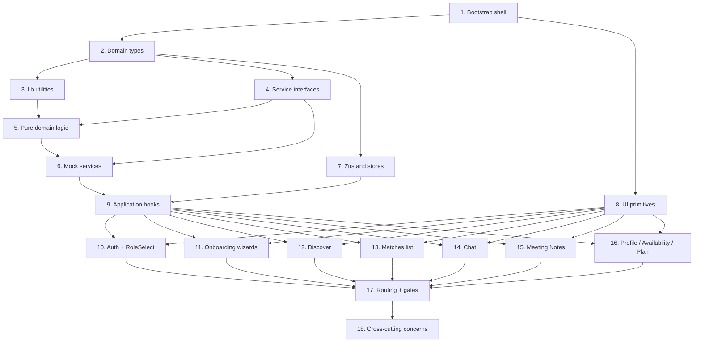

# Implementation Plan: MentorMatch MVP

## Overview

This plan turns `design.md` into a sequence of coding tasks. Work proceeds bottom-up: shared types and utilities first, then service interfaces and mocks, then UI primitives, hooks, and finally screens wired through the router. Each task references specific acceptance criteria from `requirements.md`.

The app is mock-first. Every backend dependency lives behind a TypeScript interface in `src/features/<domain>/service.ts` with an in-memory implementation in `mock.ts`. Wiring a real backend later means swapping a factory in `App.tsx`, not rewriting screens.

## Tasks

- [x] 1. Bootstrap the Vite + React + TypeScript app shell
  - Initialize Vite with the `react-ts` template, enable TypeScript strict, and install runtime deps: `react-router-dom@6`, `zustand`, `@tanstack/react-query`, `react-hook-form`, `zod`, `@hookform/resolvers`, `lucide-react`.
  - Install dev deps: `tailwindcss`, `postcss`, `autoprefixer`, `eslint`, `prettier`, `@types/node`.
  - Configure Tailwind (`tailwind.config.ts`, `postcss.config.js`) with brand tokens `primary: #7C3AED`, `accent: #EC4899` and add the base layer in `src/styles/index.css`.
  - Create the directory skeleton from `structure.md`: `src/screens/{Auth,Onboarding,Discover,Matches,Chat,MeetingNotes,Profile}`, `src/components`, `src/features/{auth,matching,messaging,notes,profile,calendar,plan}`, `src/hooks`, `src/lib`, `src/types`, `src/styles`.
  - Wire `src/main.tsx` to render `<App />` with `QueryClientProvider` and import the Tailwind stylesheet.
  - _Requirements: 8.1, 8.2_

- [x] 2. Define shared domain types
  - [x] 2.1 Identity and session types
    - Add `src/types/identity.ts` exporting `UserId`, `MatchId`, `ThreadId`, `MessageId`, `NoteId`, `SessionId`, `Role`, `PlanTier`, `VerificationStatus`, `Language`, `IanaTimeZone`.
    - Add `src/types/session.ts` exporting `Session` with `userId`, `email`, `role: Role | null`, `plan: PlanTier`, `issuedAt`, `expiresAt`.
    - _Requirements: 1.2, 1.3, 1.4, 7.5_
  - [x] 2.2 Profile and availability types
    - Add `src/types/profile.ts` with `BaseProfile`, `MeetingFrequency`, `TeachingStyle`, `MenteeProfile`, `MentorProfile`, `Profile`, `ProfilePatch`.
    - Add `src/types/availability.ts` with `AvailabilityWindow` (UTC-normalized + `authoredZone`), `TimeRange`, `BusyBlock`, `TimeSlot`.
    - _Requirements: 2.1, 3.1, 3.5, 7.3, 7.4_
  - [x] 2.3 Matching, messaging, and notes types
    - Add `src/types/matching.ts` with `MatchScore`, `CandidateProfile`, `MatchSignal`, `Match`.
    - Add `src/types/messaging.ts` with `Message`, `MessageThread`, `ScheduleProposal`.
    - Add `src/types/notes.ts` with `NoteSections`, `NoteStatus`, `MeetingNote`, `NoteGenerationRequest`.
    - _Requirements: 4.2, 5.1, 5.4, 6.2_

- [x] 3. Implement framework-agnostic utilities in `src/lib`
  - Add `src/lib/time.ts` with pure helpers: `localWindowToUtc(dayOfWeekLocal, startMinuteLocal, endMinuteLocal, zone)`, `utcWindowToLocal(window, zone)`, `isWindowSilent(lastAt, days)` for the 14-day re-engagement check.
  - Add `src/lib/id.ts` with `newId()` (crypto.randomUUID) and `canonicalUserPair(a, b)` returning a lexicographically sorted `[UserId, UserId]` for `Match.userIds`.
  - Add `src/lib/storage.ts` wrapping `localStorage` with typed `get<T>`/`set<T>`/`remove` and a JSON-safe fallback for SSR/test environments.
  - _Requirements: 3.5, 5.5, 8.5_

- [x] 4. Define service interfaces and the service provider
  - [x] 4.1 Auth, profile, and plan service interfaces
    - Add `src/features/auth/service.ts` exporting `AuthService` and `SignUpInput`.
    - Add `src/features/profile/service.ts` exporting `ProfileService` and `VerificationDocument`.
    - Add `src/features/plan/service.ts` exporting `PlanService` plus the pure helper `activeConnectionLimit(tier)` returning `3` for `"free"` and `Number.POSITIVE_INFINITY` for `"mentee_premium"` and `"mentor_pro"`.
    - _Requirements: 1.1, 1.2, 1.3, 3.3, 7.1, 7.2, 7.5_
  - [x] 4.2 Matching, messaging, notes, calendar interfaces
    - Add `src/features/matching/service.ts` exporting `MatchingService`, `QueueOpts`, `MatchOutcome` (`recorded` | `match_created` | `blocked_by_cap`).
    - Add `src/features/messaging/service.ts` exporting `MessagingService` and `Unsubscribe`.
    - Add `src/features/notes/service.ts` exporting `NotesService`.
    - Add `src/features/calendar/service.ts` exporting `CalendarService`.
    - _Requirements: 4.1, 4.5, 4.7, 5.2, 5.3, 5.4, 6.1, 6.5, 7.3, 7.4_
  - [x] 4.3 Service provider context
    - Add `src/features/serviceProvider.tsx` exporting the `Services` interface, `ServiceContext`, `<ServiceProvider value={services}>`, and `useServices()` with a runtime null check.
    - _Requirements: 8.4_

- [x] 5. Implement pure domain logic
  - [x] 5.1 Match scoring and queue ordering
    - Add `src/features/matching/scoreMatch.ts` exporting `scoreMatch(viewer: Profile, candidate: Profile): MatchScore` producing an integer 0–100 from weighted components (`skills`, `teachingStyle`, `availability`, `languages`, `values`). Clamp to `[0, 100]` and round.
    - Add `src/features/matching/orderQueue.ts` exporting `orderQueue(scored: CandidateProfile[]): CandidateProfile[]` sorting by `matchScore.value` desc with stable tiebreak by `userId`.
    - _Requirements: 4.1, 4.2_
  - [x] 5.2 Validation schemas
    - Add `src/features/profile/schemas.ts` with zod schemas: `MenteeOnboardingSchema` (subjects ≥1, careerInterests ≥1, background non-empty, languages ≥1), `MentorOnboardingSchema` (teachingStyle set, areasToTeach ≥1, yearsExperience ≥0, languages ≥1), `AvailabilityWindowSchema` (`endMinuteUtc > startMinuteUtc`, range bounds), `MessageBodySchema` (trimmed non-empty, ≤4000 chars).
    - _Requirements: 2.2, 3.2, 3.5, 5.3_
  - [x] 5.3 Match policy
    - Add `src/features/matching/matchPolicy.ts` exporting `decideOutcome({viewerActiveCount, candidateActiveCount, viewerTier, candidateTier, mutualInterest})` returning `MatchOutcome`. Always persist the interest signal; produce `match_created` only when both sides are within `activeConnectionLimit`, otherwise `blocked_by_cap`.
    - _Requirements: 4.5, 4.7, 7.5_

- [x] 6. Build in-memory mock services
  - [x] 6.1 Mock auth, profile, plan
    - Add `src/features/auth/mock.ts` implementing `AuthService` over an in-memory user store. Fake Google sign-in resolves to a deterministic seed user; sign-out clears tokens.
    - Add `src/features/profile/mock.ts` implementing `ProfileService`; `submitVerification` sets `verificationStatus = "pending"`.
    - Add `src/features/plan/mock.ts` implementing `PlanService` using `activeConnectionLimit` from task 4.1.
    - _Requirements: 1.1, 1.2, 1.3, 3.3, 7.1, 7.2, 7.5, 8.5_
  - [x] 6.2 Mock matching, messaging, notes, calendar
    - Add `src/features/matching/mock.ts` with seed candidate profiles, queue ordering via `orderQueue`, and `recordSignal` that persists signals and computes outcomes via `decideOutcome`.
    - Add `src/features/messaging/mock.ts` with an in-memory thread map and a simple pub/sub (`subscribe` returns an unsubscribe fn).
    - Add `src/features/notes/mock.ts` whose `generateNotes` returns a `MeetingNote` with all four `NoteSections` keys populated, plus a configurable failure mode for the manual fallback.
    - Add `src/features/calendar/mock.ts` returning a static set of `BusyBlock`s.
    - _Requirements: 4.1, 4.3, 4.4, 4.5, 4.7, 5.2, 5.3, 5.4, 6.1, 6.2, 6.5, 7.3, 7.4_

- [x] 7. Build the Zustand stores
  - Add `src/lib/stores/sessionStore.ts` exporting `useSessionStore` with `session: Session | null`, `setSession`, `clearSession` (in-memory only).
  - Add `src/lib/stores/onboardingStore.ts` exporting `useOnboardingStore` persisted via `zustand/middleware/persist` to `localStorage`, holding the partial mentee/mentor draft and a `currentStep` index. Includes `setDraft(patch)`, `reset()`.
  - _Requirements: 2.4, 8.5_

- [x] 8. Build cross-screen UI primitives in `src/components`
  - [x] 8.1 Buttons, cards, surfaces
    - Implement `Button.tsx` (primary/secondary/ghost), `Card.tsx`, `Sheet.tsx`, `Avatar.tsx` (with initials fallback), `Badge.tsx`, `Tag.tsx`, `EmptyState.tsx`. Tailwind only; respect WCAG AA contrast for primary CTAs.
    - _Requirements: 8.1_
  - [x] 8.2 Forms and stepper
    - Implement `FormField.tsx` (label + input + error wrapper, integrates with `react-hook-form` `register`) and `Stepper.tsx` (current step / total).
    - _Requirements: 2.1, 3.1_
  - [x] 8.3 Match-specific primitives
    - Implement `SwipeCard.tsx` (presentational card showing avatar, name, summary, tags, and `MatchBadge`) and `MatchBadge.tsx` (color ramp by score). Gestures live in `SwipeDeck` (task 12.1).
    - _Requirements: 4.2_

- [x] 9. Implement application hooks
  - [x] 9.1 `useAuth`
    - Add `src/hooks/useAuth.ts` wrapping `AuthService` and `useSessionStore`. Exposes `session`, `signInWithGoogle`, `signUpWithEmail`, `signOut` (also clears persisted client tokens via `src/lib/storage.ts`), `setRole`.
    - _Requirements: 1.1, 1.2, 1.3, 1.4, 8.5_
  - [x] 9.2 `useProfile` and `usePlan`
    - Add `src/hooks/useProfile.ts` using TanStack Query for `getProfile` and a mutation for `update` that invalidates the candidate-queue cache (re-score).
    - Add `src/hooks/usePlan.ts` exposing `tier`, `activeConnectionLimit`, `upgrade`.
    - _Requirements: 7.1, 7.2, 7.5_
  - [ ] 9.3 `useMatchQueue` _(skipped — DemoProvider drives the queue directly via `MatchingService.fetchQueue` / `recordSignal`)_
    - Add `src/hooks/useMatchQueue.ts` querying `MatchingService.fetchQueue` and exposing `recordInterest` and `recordPass`. Optimistically removes the swiped card and returns the `MatchOutcome` to the caller.
    - _Requirements: 4.1, 4.3, 4.4, 4.5, 4.6, 4.7_
  - [x] 9.4 `useMessageThread`
    - Add `src/hooks/useMessageThread.ts` that loads a thread, subscribes to updates, exposes optimistic `send(body)` validated by `MessageBodySchema`, and `proposeMeeting(slot)`. Surfaces an `isSilent` boolean computed via `isWindowSilent`.
    - _Requirements: 5.2, 5.3, 5.4, 5.5_
  - [x] 9.5 `useMeetingNotes`
    - Add `src/hooks/useMeetingNotes.ts` exposing `notes`, `generateFor(sessionId)`, `saveManual(noteId, sections)`. On generation failure, set `status = "failed"`, schedule a background retry, and surface the manual-fallback flag.
    - _Requirements: 6.1, 6.2, 6.3, 6.4, 6.5_

- [x] 10. Build Auth and RoleSelect screens _(delivered via `src/demo/screens/AuthScreen.tsx` + `RoleSelectScreen.tsx`)_
  - [x] 10.1 Auth forms
    - In `src/screens/Auth`, build `AuthScreen.tsx` with tabs for Sign in / Sign up. Implement `LoginForm.tsx` and `SignUpForm.tsx` using `react-hook-form` + `zod`; the Google button calls `useAuth().signInWithGoogle()`.
    - _Requirements: 1.1_
  - [x] 10.2 Role selection
    - Add `src/screens/Auth/RoleSelectScreen.tsx` rendering two cards (Mentee / Mentor). On tap, call `useAuth().setRole(role)` and navigate to `/onboarding`.
    - _Requirements: 1.2, 1.3_

- [ ] 11. Build Onboarding wizards _(skipped for MVP demo — viewer profiles are seeded in `src/demo/data.ts` so the role-select flow lands directly on Discover)_
  - [ ] 11.1 Wizard shell
    - Add `src/screens/Onboarding/OnboardingWizard.tsx` reading the current `role` from session, rendering the matching step list, persisting the draft via `useOnboardingStore`, and submitting through `ProfileService.updateProfile` on completion.
    - _Requirements: 2.1, 2.4, 3.1_
  - [ ] 11.2 Mentee steps
    - Implement under `src/screens/Onboarding/MenteeSteps/`: `SubjectsStep`, `CareerInterestsStep`, `BackgroundStep`, `OtherInterestsStep`, `LanguagesStep`, `MeetingFrequencyStep`, `TeachingStyleStep`, `ValuesStep`. Validate the final submission against `MenteeOnboardingSchema`. On success, request initial recommendations via `MatchingService.fetchQueue`.
    - _Requirements: 2.1, 2.2, 2.3_
  - [ ] 11.3 Mentor steps
    - Implement under `src/screens/Onboarding/MentorSteps/`: `TeachingStyleStep`, `AreasToTeachStep`, `ExperienceStep`, `IndustriesStep`, `AvailabilityStep` (uses `localWindowToUtc`), `LanguagesStep`, `ValuesStep`, `SupportedBackgroundsStep`, `VerificationStep`. Validate against `MentorOnboardingSchema`.
    - _Requirements: 3.1, 3.2, 3.5_
  - [ ] 11.4 Verification upload
    - Add `src/screens/Onboarding/VerificationUpload.tsx` accepting a single file and calling `ProfileService.submitVerification`. Mark `verificationStatus = "pending"` in the local cache.
    - _Requirements: 3.3, 3.4_

- [x] 12. Build Discover screen _(delivered via `src/demo/screens/DiscoverScreen.tsx` + `CandidateDetailScreen.tsx`)_
  - [x] 12.1 Swipe deck and gestures
    - Add `src/screens/Discover/SwipeDeck.tsx` handling pointer/touch gestures with native APIs (no extra gesture lib required) and exposing `onSwipeLeft`, `onSwipeRight`, plus discrete green-check / red-X tap targets. Renders the top `SwipeCard`.
    - _Requirements: 4.2, 4.3, 4.4_
  - [x] 12.2 Discover screen and outcomes
    - Add `src/screens/Discover/DiscoverScreen.tsx` reading from `useMatchQueue`. Wire swipe-right to `recordInterest`, swipe-left to `recordPass`. On `match_created`, render `MatchCelebration.tsx`. On `blocked_by_cap`, surface a sheet directing the user to upgrade or archive.
    - _Requirements: 4.1, 4.3, 4.4, 4.5, 4.7_
  - [x] 12.3 Empty queue
    - Add `src/screens/Discover/EmptyQueue.tsx` rendered when the queue is empty, inviting the user to broaden preferences or check back later.
    - _Requirements: 4.6_

- [x] 13. Build Matches list screen _(delivered via `src/demo/screens/MatchesScreen.tsx`)_
  - Add `src/screens/Matches/MatchesScreen.tsx` listing unarchived matches with partner name, match-percentage badge, and last-message preview from `MessagingService.loadThread`.
  - Add `src/screens/Matches/MatchListItem.tsx` rendering avatar, name, badge, preview, and unread dot.
  - _Requirements: 5.1_

- [x] 14. Build Chat screen _(delivered via `src/demo/screens/ChatScreen.tsx`)_
  - [x] 14.1 Message list and composer
    - Add `src/screens/Chat/ChatScreen.tsx` orchestrating header, `MessageList.tsx`, and `Composer.tsx`. Use `useMessageThread`. Validate composer input via `MessageBodySchema`.
    - _Requirements: 5.3_
  - [x] 14.2 Conversation prompts
    - Add `src/screens/Chat/ConversationPrompts.tsx` rendering 3 AI-suggested openers (e.g., "Share goals", "Ask about industry", "Request portfolio feedback") above the composer when the thread has no messages. Tapping a prompt prefills the composer.
    - _Requirements: 5.2_
  - [ ] 14.3 Scheduling card and re-engagement banner
    - Add `src/screens/Chat/SchedulingCard.tsx` rendered for messages tagged as proposals; reads availability via `CalendarService.fetchBusyBlocks` to dim conflicting slots.
    - Add `src/screens/Chat/ReengagementBanner.tsx` surfaced when `useMessageThread().isSilent` is true (14 days idle).
    - _Requirements: 5.4, 5.5, 7.4_

- [-] 15. Build Meeting Notes screens
  - Add `src/screens/MeetingNotes/NotesListScreen.tsx` showing a chronological list with date, duration, and summary preview, sourced from `useMeetingNotes`.
  - Add `src/screens/MeetingNotes/NoteDetailScreen.tsx` rendering all four sections (`Discussion Summary`, `Action Items`, `Next Meeting Goals`, `Shared Resources`).
  - Add `src/screens/MeetingNotes/ManualNoteEntry.tsx` editor used when `note.status === "failed"`. Saving calls `useMeetingNotes().saveManual`.
  - _Requirements: 6.1, 6.2, 6.3, 6.4, 6.5_

- [x] 16. Build Profile, Availability, and Plan screens _(Profile delivered via `src/demo/screens/ProfileScreen.tsx` with upgrade CTA; availability + plan deeper screens skipped for MVP demo)_
  - [-] 16.1 Profile read and edit
    - Add `src/screens/Profile/ProfileScreen.tsx` (read view: skills, career interests, learning style, languages, plan tier).
    - Add `src/screens/Profile/ProfileEditScreen.tsx` form using `useProfile().update`. On save, the candidate queue is invalidated (re-score).
    - _Requirements: 7.1, 7.2_
  - [ ] 16.2 Availability and Google Calendar sync _(skipped for MVP demo)_
    - Add `src/screens/Profile/AvailabilityScreen.tsx` showing saved windows (converted to local zone via `utcWindowToLocal`) with edit affordances and a "Sync with Google Calendar" toggle wired to `CalendarService.enableGoogleSync`/`disableSync`. When sync is enabled, set up a 15-minute refetch interval against `fetchBusyBlocks`.
    - _Requirements: 7.3, 7.4_
  - [x] 16.3 Plan management _(upgrade CTA wired into demo `ProfileScreen.tsx` via `useDemo().upgrade()`)_
    - Add `src/screens/Profile/PlanScreen.tsx` showing the current tier and upgrade CTAs for Mentee Premium ($9.99/mo) and Mentor Pro ($4.99/mo). On upgrade, call `usePlan().upgrade(target)`.
    - _Requirements: 7.5_

- [x] 17. Wire routing and navigation gates _(delivered via `src/demo/DemoApp.tsx` — BrowserRouter + `RequireSession` gate + bottom nav)_
  - Add `src/routes.tsx` declaring the route table from the design (kebab-case: `/discover`, `/matches`, `/chat/:matchId`, `/meeting-notes/:matchId`, `/meeting-notes/:matchId/:noteId`, `/profile`, `/profile/availability`, `/profile/plan`, `/auth`, `/auth/role`, `/onboarding`).
  - Implement `<AuthGate>`, `<RoleGate>`, `<ProfileGate>` in `src/components/` that read from `useSessionStore` and redirect appropriately.
  - Update `src/App.tsx` to mount `<BrowserRouter>`, `<ServiceProvider value={mockServices}>`, the `QueryClientProvider`, and the route table guarded by the gates.
  - _Requirements: 1.4, 1.5_

- [ ] 18. Cross-cutting concerns _(deferred — not blocking MVP demo)_
  - [ ] 18.1 Sign-out token clearing
    - In `useAuth().signOut`, after `AuthService.signOut`, clear the session store and remove all persisted client keys via `src/lib/storage.ts`.
    - _Requirements: 8.5_
  - [ ] 18.2 Analytics event helper
    - Add `src/lib/analytics.ts` exporting `logEvent(name, payload)` that strips message bodies and PII before forwarding to a sink. Call it from `useMatchQueue.recordInterest` (on `match_created`), `useMessageThread.send`, and `useMeetingNotes.generateFor`.
    - _Requirements: 8.4_
  - [ ] 18.3 Performance budget for Discover
    - Lazy-load non-Discover screens via `React.lazy` + `Suspense` in `routes.tsx` so the Discover bundle loads first. Preload candidate avatars in `useMatchQueue` for the next two cards.
    - _Requirements: 8.2_

## Task Dependency Graph



```json
{
  "waves": [
    { "id": 1, "tasks": ["1"] },
    { "id": 2, "tasks": ["2"] },
    { "id": 3, "tasks": ["3", "4", "7", "8"] },
    { "id": 4, "tasks": ["5"] },
    { "id": 5, "tasks": ["6"] },
    { "id": 6, "tasks": ["9"] },
    { "id": 7, "tasks": ["10", "11", "12", "13", "14", "15", "16"] },
    { "id": 8, "tasks": ["17"] },
    { "id": 9, "tasks": ["18"] }
  ]
}
```

## Notes

- Tasks 2–9 are foundation work and have no UI surface. They are testable as pure modules.
- Task 12 (Discover) is the highest-value visible milestone; the lazy-loading work in 18.3 protects its LCP budget.
- Mocks live behind `useServices()` so swapping in real HTTP adapters later is a single change in `App.tsx`.
- Test files are not part of this plan. Add `*.test.ts(x)` next to a module only when explicitly requested.
